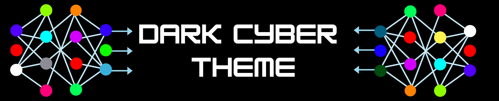
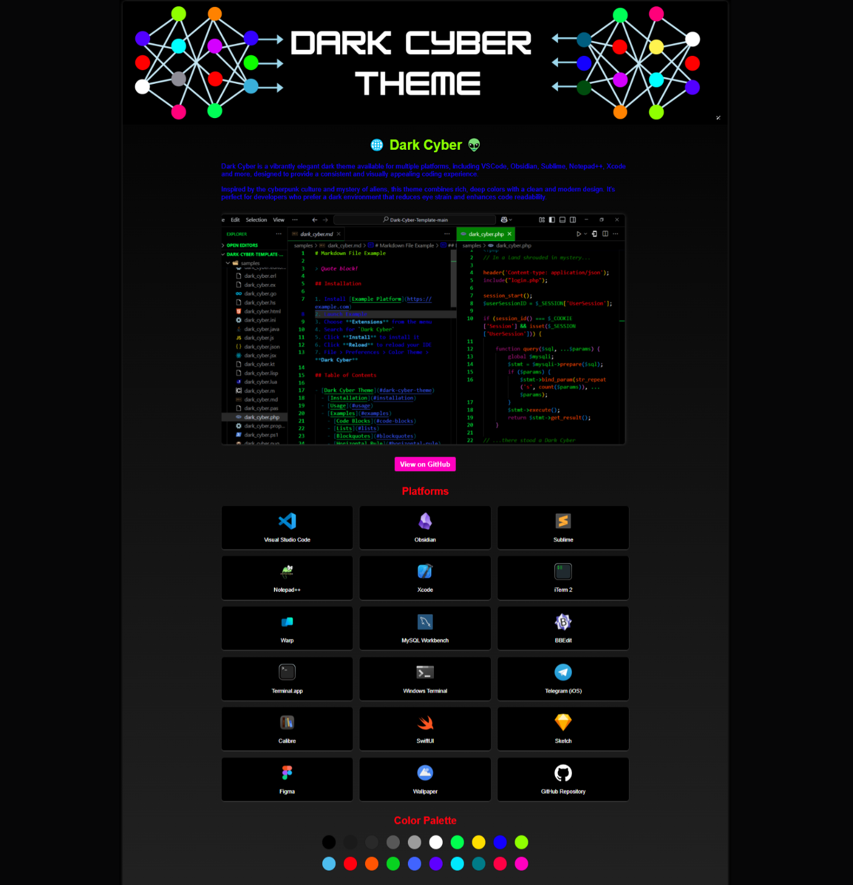
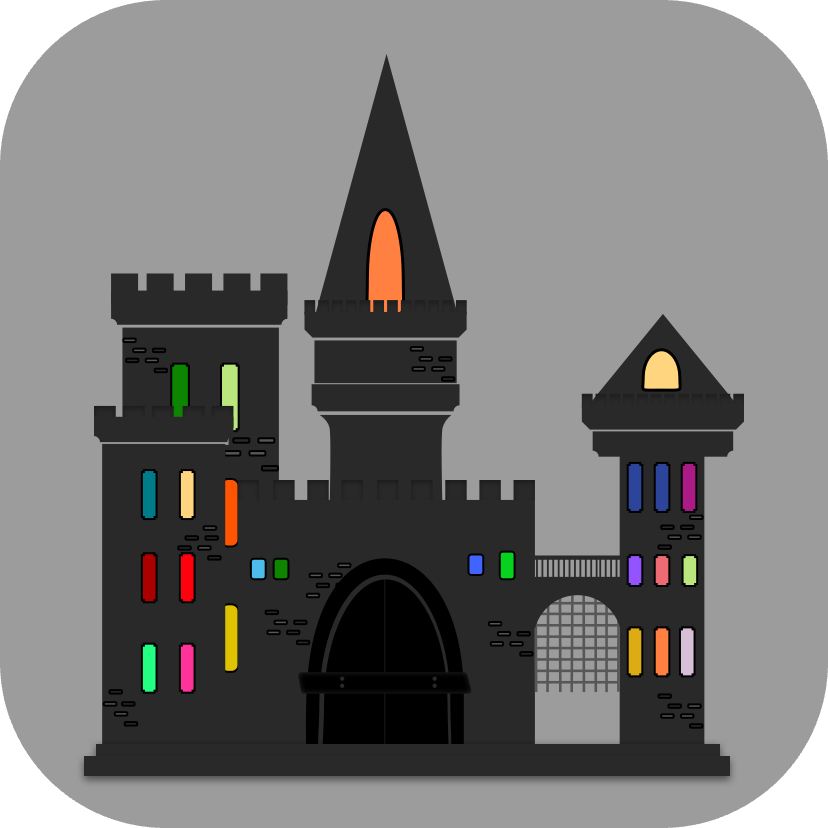

    <a href="https://darkcyber.netlify.app" target="_blank">
         <!-- Add a specific width/height for your icon here, ex. width="150" height="150"-->
    </a>

 

    
    
    
     
    
    
    
     
    

---

<h1 align="center">🌐 Dark Cyber Theme Website 👽</h1>
 

    

  A vibrantly elegant dark theme available for multiple platforms. Inspired by the cyberpunk culture and mystery of aliens, this theme combines rich, deep colors with a clean and modern design.

    

This is official website for **[Dark Cyber Theme](https://github.com/jonypeixoto/Dark-Cyber-Theme)**.

- Visit the website that's built by this repository [here](https://darkcyber.netlify.app).
- Check out our **Dark Cyber Theme** main repository [here](https://github.com/jonypeixoto/Dark-Cyber-Theme).
- Visit our **Business Website** repository, which this website was based on [here](https://github.com/jonypeixoto/Business-Website), if you would like to use it to create your own website (See the `README` for instructions).
- Finally, see our **Business Website** in action [here](https://nightowllabs.io).

## License

This project is released under the terms of the **MIT License**, which permits use, modification, and distribution of the code, subject to the conditions outlined in the license.

- The [MIT License](https://choosealicense.com/licenses/mit/) provides certain freedoms while preserving rights of attribution to the original creators.
- For more details, see the [LICENSE](LICENSE) file in this repository.

## Credits

**Author:** [Jony Peixoto](https://github.com/jonypeixoto)  
**Email:** [jonypeixotooriginal@gmail.com](mailto:jonypeixotooriginal@gmail.com)  
**Website:** [jonypeixoto.engineer](https://www.jonypeixoto.engineer)  
**Reference:** [Main Branch](https://github.com/jonypeixoto/Dark-Cyber-Website)  

---

    

